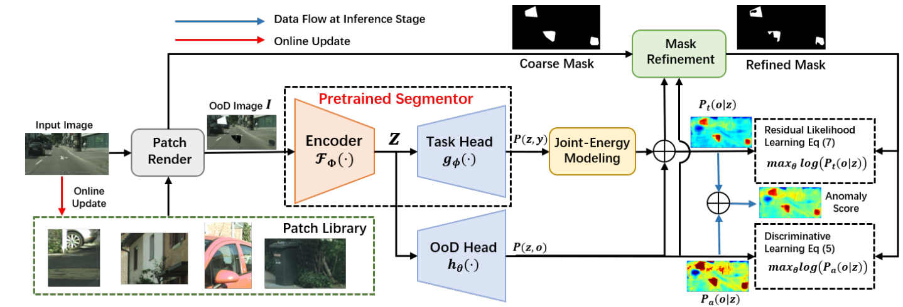
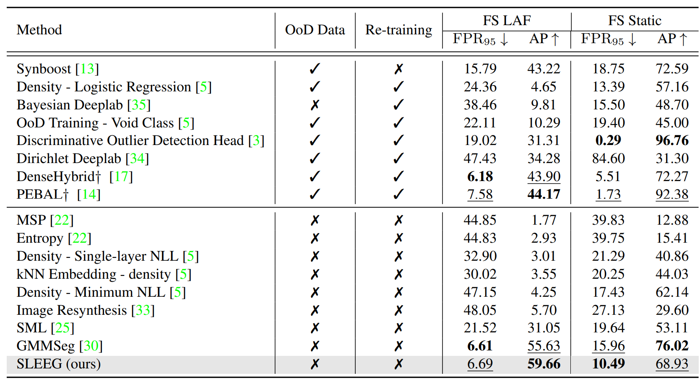

# SLEEG
Official implementation of our AAAI paper: **Self-supervised Likelihood Estimation with Energy Guidance for Anomaly Segmentation in Urban Scenes**

# Self-supervised Likelihood Estimation with Energy Guidance for Anomaly Segmentation in Urban Scenes (AAAI 2024) 

This is the pytorch implementation of the [paper](https://arxiv.org/pdf/2302.06815.pdf) (accepted by AAAI 2024).



# Performance



# Installation  
For the training set and test set, please refer to [link](https://github.com/tianyu0207/PEBAL/blob/main/docs/installation.md) to download cityscapes and fishyscapes datasets.
Place the downloaded dataset at ./data/.

The docker file for running our SLEEG can be found in ./docker, where the submission file of our SLEEG on the Fishyscapes dataset is also available.

# Training
```
bash scripts/train.sh
```

# Inference 

```
bash scripts/static.sh
```

The trained weights of SLEEG are available at [link](https://drive.google.com/drive/folders/1ghhTTIeIroF2-XWZuPxHdTxUQc6QS2f4?usp=sharing).

Our results on the leaderboard of Fishyscapes can be found in [link](https://fishyscapes.com/results), where anonymous submission (mall) is our SLEEG.

# Acknowledgement & Citation
The code is built on mmseg. Many thanks for their great work.
If you find this repo useful for your research, please consider citing our paper:
```bibtex
@misc{tu2023selfsupervised,
      title={Self-supervised Likelihood Estimation with Energy Guidance for Anomaly Segmentation in Urban Scenes}, 
      author={Yuanpeng Tu and Yuxi Li and Boshen Zhang and Liang Liu and Jiangning Zhang and Yabiao Wang and Chengjie Wang and Cai Rong Zhao},
      year={2023},
      eprint={2302.06815},
      archivePrefix={arXiv},
      primaryClass={cs.CV}
}
```
